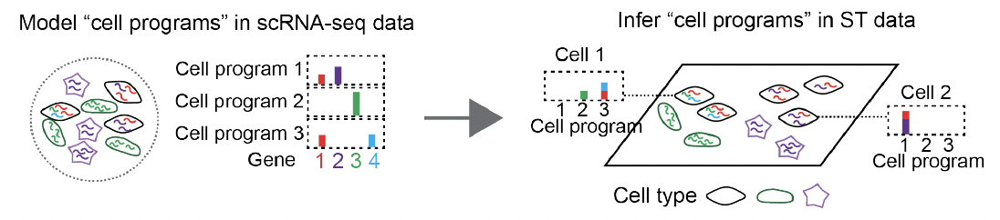

# HTHubID: Identifying and characterizing functional cell programs and landscapes in scRNA and spatial transcriptomic data

## Overview of cell program identification in single cells.

HDP was first applied to model cell programs in scRNA-seq data (left). The cell programs were represented as distributions of genes. Next, the model was applied in the cells from both scRNA-seq and MERFISH datasets from CRC patients (right) to infer the proportion of cell programs in individual cells. In the simplified illustration, the three different shapes represent cells of three distinct cell types. Each color of strings within the cells denotes a specific gene with a total of four distinct genes detected in the image data. In the bar plot for cell programs, the heights of each bar are proportional to the contributions of each of the four genes, with the colors corresponding to the colors of the strings inside cells.

